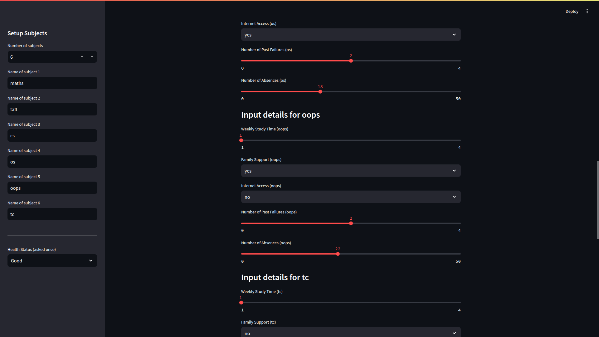

# Student Performance Prediction System

## Overview

The **Student Performance Prediction System** leverages machine learning to predict whether a student will pass or fail based on academic and personal attributes. This project aims to assist educators, parents, and institutions in identifying students at risk, enabling timely intervention and improved learning outcomes.

## Features

- **Interactive Input Form:** Users can input student details such as gender, weekly study time, family support, internet access, number of past failures, absences, and health.
- **Automated Prediction:** Predicts the likelihood of a student passing or failing with a confidence percentage.
- **Visual Feedback:** Provides clear feedback messages for predictions.
- **Jupyter Notebook-Based:** The codebase is primarily Jupyter Notebooks for interactive analysis and prototyping.
- **Customizable:** Supports adaptation to additional datasets and features.

## Demo

Below are screenshots showcasing the interface and prediction results:

### Input Interface


### Prediction - Likely to Fail


### Prediction - Likely to Pass


### Alternate Input State



## Getting Started

### Prerequisites

- Python 3.7+
- Jupyter Notebook or JupyterLab

### Installation

1. **Clone the repository:**
   ```bash
   git clone https://github.com/tanishqkumar700/Student_Performance_Prediction_System.git
   cd Student_Performance_Prediction_System
   ```

2. **Install dependencies:**
   ```bash
   pip install -r requirements.txt
   ```

### Usage

1. **Launch Jupyter Notebook:**
   ```bash
   jupyter notebook
   ```
2. **Open and run the main notebook** (`Student_Performance_Prediction.ipynb`) to explore data, preprocess features, train models, and make predictions.
3. **Try the interactive interface** (as shown in the screenshots above) to input data and receive predictions.

## Repository Structure

```
Student_Performance_Prediction_System/
│
├── data/                       # Sample datasets
├── models/                     # Trained models (if any)
├── file.ipynb  # Main notebook
├── requirements.txt            # Python dependencies
└── README.md                   # Project documentation
```

## Technologies Used

- Python
- Jupyter Notebook
- pandas, numpy
- scikit-learn
- matplotlib

## License

This project is licensed under the [MIT License](LICENSE).

## Contact

For questions, suggestions, or contributions, please open an issue or contact [tanishqkumar700](https://github.com/tanishqkumar700).
